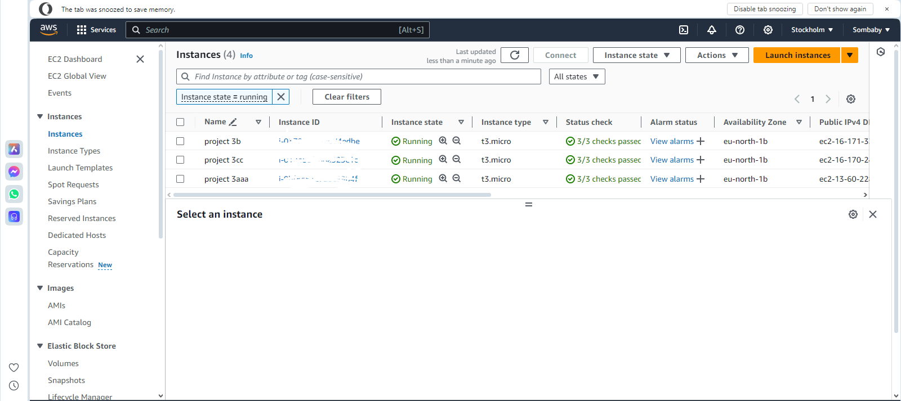
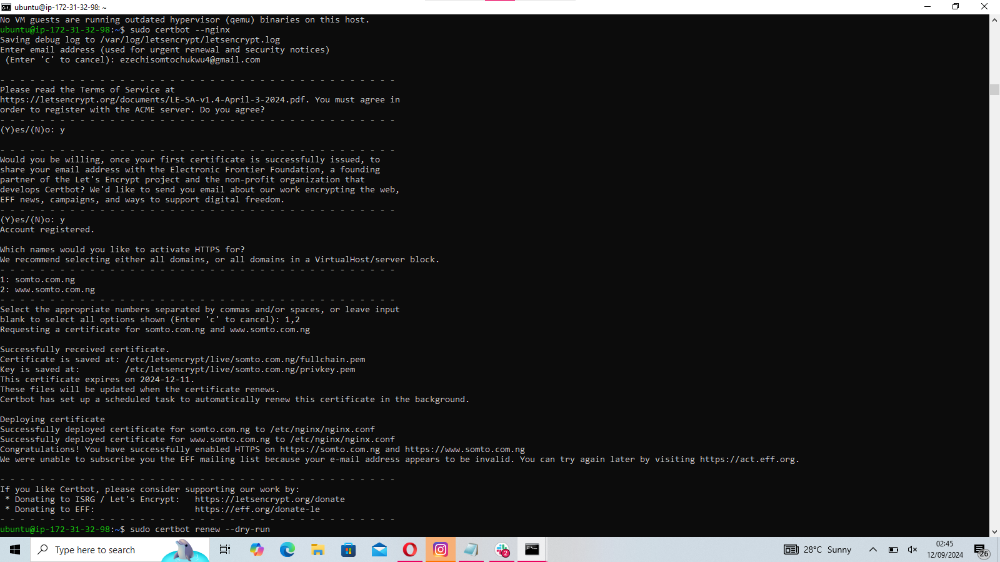

# project 3: setup load balancing for static websites using Nginx

## Introduction

in my third project,I practiced setting up load balancing for static websites using Nginx. This project involved 

configuring Nginx as a load balancer to distribute traffic across multiple servers, enhancing reliability and 

availability.

### Type of load balancer

I used Nginx as a reverse proxy load balancer, which helps distribute traffic evenly across multiple servers.

###  Step 1; Deploying three servers

i deployed 3 servers; one for load balaning & two for hosting the static websites

###  Step 2;  Setting Up Static Websites on two servers using Nginx

I set up static websites on the first two servers using Nginx:

1. I installed Nginx and configured each server to host distinct html content, ensuring they could be differentiated when accessed

2. For each server, I used different HTML templates to clearly distinguish between the two during load balancing tests

   

###  Step 3: Configuring Nginx as a Load Balancer

I configured the third server to act as a load balancer:

I installed Nginx and set up the load balancing configuration to distribute requests between the two website servers using a round-robin method also added the http block by running the command

''' upstream whoislocal {
            server 172.31.41.207
            server 172.31.32.248;
    }

    server {
            server_name whoislocal.com www.whoislocal.com;

            location / {
                    proxy_pass http://whoislocal;
        }
  }
  '''

  ###  DNS Configuration and Validation
  
 I added an A record for the load balancer in DNS to allow public access:

In Route 53, I pointed my domain to the IP of the Nginx load balancer server.

I tested the load balancing by accessing the domain and observed the requests being alternately served by the two backend servers. 

   

###  Step 5 Step 5: Securing the Websites with SSL/TLS

To secure the traffic between the client and the load balancer, I installed SSL certificates:

I ran Certbot on the load balancer server to obtain and configure SSL certificates for the domain.

sudo certbot --nginx -d whoislocal.com -d www.whoislocal.com

I confirmed the security by accessing the websites via HTTPS and using OpenSSL to inspect the SSL certificate.

openssl s_client -connect whoislocal.com:443

   

### Conclusion

The load balancer distributed traffic evenly on the two websites

The end of project 3

